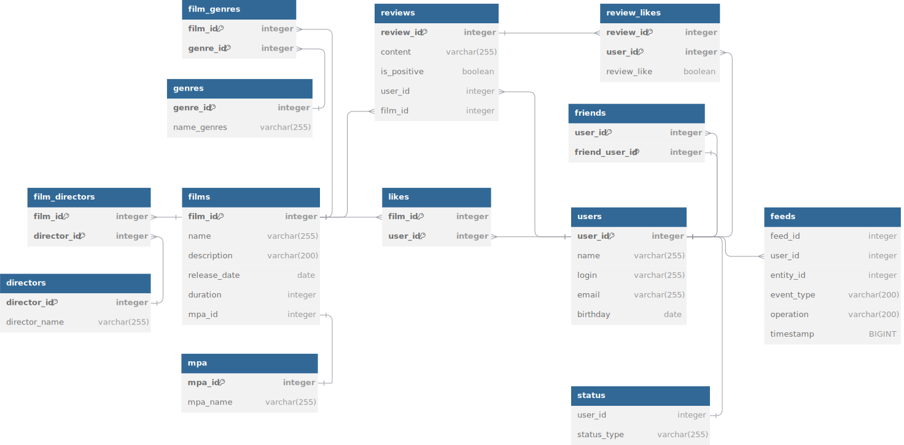

# Filmorate project

Filmorate - это бэкэнд-сервис на основе Restful API для хранения и управления информацией о фильмах(название, рейтинг MPA, жанр, описание и продолжительность), составления рейтинга фильмов на основе отзывов пользователей, поиска фильма, а также для общения пользователей.

## Стек технологий
* Java 21, Spring Boot, Lombok, Maven, REST API, JDBC, SQL, H2, JUnit

## Описание API

### Films

| HTTP request                                                    | Method                  | Description                                                        |
|-----------------------------------------------------------------|-------------------------|--------------------------------------------------------------------|
| **GET** /films/{id}                                             | **getById**             | Получение информации о фильме по его id                            |
| **GET** /films                                                  | **findAll**             | Получение списка всех фильмов                                      |
| **POST** /films                                                 | **create**              | Создание фильма                                                    |
| **PUT** /films                                                  | **update**              | Редактирование фильма                                              |
| **DELETE** /films/{id}                                          | **delete**              | Удаление фильма по id                                              |
| **PUT** /films/{id}/like/{userId}                               | **putLike**             | Добавление лайка фильму                                            |
| **DELETE** /films/{id}/like/{userId}                            | **deleteLike**          | Удаление лайка к фильма                                            |
| **GET** /films/popular?count={count}                            | **getBestFilm**         | Получение списка фильмов по количеству лайков                      |
| **GET** /films/director/directorId={directorId}?sortBy={sortBy} | **directorFilmsSortBy** | Получение всех фильмов режиссера с сортировкой по лайкам или годам |
| **GET** /films/search?query={query}?by={by}                     | **search**              | Поиск фильмов по заголовку и режиссеру                             |
| **GET** /films/common?userId={userId}?friendId={friendId}       | **common**              | Получение общих фильмов пользователя и его друга                   |

### Users 

| HTTP request                                 | Method               | Description                                           |
|----------------------------------------------|----------------------|-------------------------------------------------------|
| **GET** /users/{id}                          | **getById**          | Получение данных о пользователе по id                 |
| **GET** /users                               | **findAll**          | Получение списка всех пользователей                   |
| **POST** /users                              | **create**           | Создание пользователя                                 |
| **PUT** /users                               | **update**           | Редактирование фильма                                 |
| **DELETE** /users/{userId}                   | **delete**           | Удаление пользователя по id                           |
| **PUT** /users/{id}/friends/{friendId}       | **addNewFriend**     | Добавление в друзья                                   |
| **DELETE** /users/{id}/friends/{friendId}    | **deleteFriend**     | Удаление из друзей                                    |
| **GET** /users/{id}/friends                  | **getAllFriends**    | Получение списка друзей                               |
| **GET** /users/{id}/friends/common/{otherId} | **getMutualFriends** | Получение списка друзей, общих с другим пользователем |
| **GET** /users/{id}/recommendations          | **recommendations**  | Получение рекомендаций по фильмам                     |
| **GET** /users/{id}/feed                     | **getFeeds**         | Возвращает ленту событий пользователя                 |

### Directors

| HTTP request               | Method               | Description                        |
|----------------------------|----------------------|------------------------------------|
| **GET** /directors/{id}    | **getById**          | Получение данных о режиссере по id |
| **GET** /directors         | **findAll**          | Получение списка всех режиссеров   |
| **POST** /directors        | **create**           | Создание режиссера                 |
| **PUT** /directors         | **update**           | Редактирование режиссера           |
| **DELETE** /directors/{id} | **delete**           | Удаление режиссера по id           |

### Genres

| HTTP request         | Method               | Description                    |
|----------------------|----------------------|--------------------------------|
| **GET** /genres/{id} | **getById**          | Получение данных о жанре по id |
| **GET** /genres      | **findAll**          | Получение списка всех жанров   |

### MPA 

| HTTP request      | Method               | Description                     |
|-------------------|----------------------|---------------------------------|
| **GET** /mpa/{id} | **getById**          | Получение данных о МРА по id    |
| **GET** /mpa      | **findAll**          | Получение списка всех рейтингов |

### Reviews

| HTTP request                                    | Method            | Description                              |
|-------------------------------------------------|-------------------|------------------------------------------|
| **GET** /reviews/{id}                           | **getById**       | Получение информации об отзыве по его id |
| **GET** /reviews?filmId={filmId}?count={count}  | **findAll**       | Получение списка всех отзывов            |
| **POST** /reviews                               | **create**        | Создание отзыва                          |
| **PUT** /reviews                                | **update**        | Редактирование отзыва                    |
| **DELETE** /reviews/{id}                        | **delete**        | Удаление отзыва по id                    |
| **PUT** /reviews/{id}/like/{userId}             | **putLike**       | Добавление лайка                         |
| **PUT** /reviews/{id}/dislike/{userId}          | **putDislike**    | Добавление дизлайка                      |
| **DELETE** /reviews/{id}/like/{userId}          | **deleteLike**    | Удаление лайка                           |
| **DELETE** /reviews/{id}/dislike/{userId}       | **deleteDislike** | Удаление дизлайка                        |

## ER диаграмма

## Описание таблиц

[//]: # (#### Films)

Films

| Столбец      | Тип          | Описание                  | Примечание     |
|--------------|--------------|---------------------------|----------------|
| film_id      | int          | уникальный идентификатор  | PK             |
| name         | varchar      | название фильма           | NOT NULL       |
| description  | varchar(255) | описание фильма           |                |
| release_date | date         | дата релиза               | NOT NULL       |
| duration     | int          | длительность фильма в мин |                |
| mpa_id       | int          | id рейтинга               | FK(mpa.mpa_id) |

[//]: # (#### )

Users

| Столбец  | Тип          | Описание                 | Примечание       |
|----------|--------------|--------------------------|------------------|
| user_id  | int          | уникальный идентификатор | PK               |
| name     | varchar(255) | имя пользователя         |                  |
| login    | varchar(255) | логин                    | NOT NULL, UNIQUE |
| email    | varchar(255) | email                    | NOT NULL, UNIQUE |
| birthday | date         | день рождения            | NOT NULL         |

[//]: # (#### )

Friends

| Столбец          | Тип     | Описание         | Примечание            |
|------------------|---------|------------------|-----------------------|
| user_id          | int     | id пользователя  | PK, FK(users.user_id) |
| friend_id        | int     | id друга         | PK, FK(users.user_id) |

[//]: # (#### )

Likes

| Столбец | Тип | Описание        | Примечание            |
|---------|-----|-----------------|-----------------------|
| film_id | int | id фильма       | PK, FK(films.film_id) |
| user_id | int | id пользователя | PK, FK(users.user_id) |

[//]: # (#### )

Genres

| Столбец    | Тип          | Описание                 | Примечание |
|------------|--------------|--------------------------|------------|
| genre_id   | int          | уникальный идентификатор | PK         |
| genre_name | varchar(255) | название                 | NOT NULL   |

| genre_id | name           |
|----------|----------------|
| 1        | Комедия        |
| 2        | Драма          |
| 3        | Мультфильм     |
| 4        | Триллер        |
| 5        | Документальный |
| 6        | Боевик         |

[//]: # (#### )

Film_genres

| Столбец  | Тип | Описание  | Примечание              |
|----------|-----|-----------|-------------------------|
| film_id  | int | id фильма | PK, FK(films.film_id)   |
| genre_id | int | id жанра  | PK, FK(genres.genre_id) |

[//]: # (#### )

MPA

| Столбец  | Тип          | Описание                 | Примечание |
|----------|--------------|--------------------------|------------|
| mpa_id   | int          | уникальный идентификатор | PK         |
| mpa_name | varchar(255) | название                 | NOT NULL   |

| mpa_id    | mpa_name | description                                                              |
|-----------|----------|--------------------------------------------------------------------------|
| 1         | 	G       | нет возрастных ограничений                                               |
| 2         | 	PG      | детям рекомендуется смотреть фильм с родителями                          |
| 3         | 	PG-13   | детям до 13 лет просмотр не желателен                                    |
| 4         | 	R       | лицам до 17 лет просматривать фильм можно только в присутствии взрослого |
| 5         | 	NC-17   | лицам до 18 лет просмотр запрещён                                        |

## Дамп БД
- [schema.sql](src/main/resources/schema.sql)
- [data.sql](src/main/resources/data.sql)